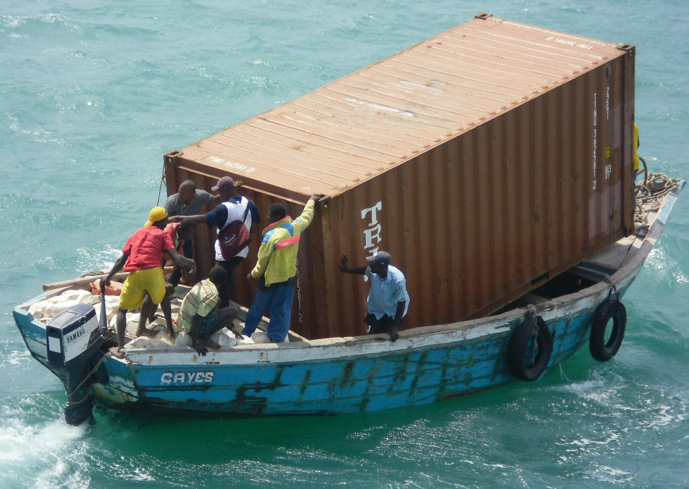

# microcontainers
One of the reasons that Docker has become so popular is because of


https://martinfowler.com/articles/microservices.html

http://microservices.io/patterns/index.html

however if, for example, you go ahead and naively pull the official Node image from dockerhub
````
docker pull node
docker images
````

You might be surprised to note that the image is **663MB**.

and your microservice *just might* not be  quite as "micro" as you were expecting!



The idea of a microcontainer is that it contains only the OS libraries and language dependencies required to run an application plus the application itself. Nothing more.

https://www.iron.io/microcontainers-tiny-portable-containers/

## Enter Alpine
Fortunately Docker has recently started giving the option using [Alpine Linux](https://alpinelinux.org/) as the base for official images which makes things **a lot** smaller.

````
docker pull node:alpine
docker images
````

Which is significantly smaller than the previous image weighing in at only 54.6 MB.

## Rolling your own...
As a first stab at rolling our own Alpine based Node image we start with a Dockerfile that looks like this:
````
FROM alpine

RUN apk update && apk upgrade \
    && apk add nodejs \
    && npm uninstall -g npm \
    && rm -rf /var/cache/apk/*
````
and build it like this:
````
docker build --no-cache -t alpine-node .
````

Which at **28.2 MB** is somewhat smaller again, probably due to removing npm (remember this is intended to be a runtime image).

This image uses the latest Alpine (currently 3.5.0)
````
docker run --rm alpine-node /bin/cat /etc/alpine-release
````

and nodejs 6.9.2
````
docker run --rm alpine-node node --version
````

## iron.io images
[iron.io](http://www.iron.io) have really gone to town and built uber tiny Docker images for a wide range of languages also based on [Alpine Linux](https://alpinelinux.org/).

https://github.com/iron-io/dockers

https://hub.docker.com/u/iron/

````
docker pull iron/node
docker images
````

Which has reduced the size of the base Node image to only **18.6 MB**

However note that this image uses an older version of Alpine (currently 3.3.0)
````
docker run --rm iron/node /bin/cat /etc/alpine-release
````

and nodejs 5.10.1
````
docker run --rm iron/node node --version
````

